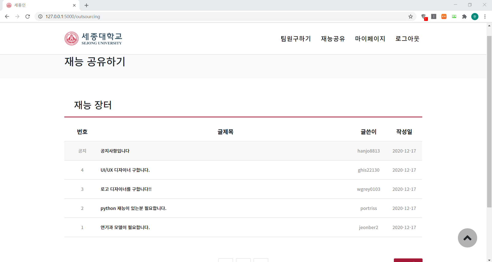

# < 해커톤 2020 >

### 세종대학교 2020 후반기 해커톤 프로젝트 세종인

## 팀원

|이름|분야|
|---|---|
|<a href="https://github.com/hon99oo">강홍구</a>|💰 Block Chain|
|<a href="https://github.com/ghis22130">김지수</a>|📂 DB, Backend|
|<a href="https://github.com/woogie-s">신현욱</a>|💰 Block Chain|
|<a href="https://github.com/Jaeyooou">안재현</a>|📂 DB, Backend|
|<a href="https://github.com/hanjo8813">한재원</a>|📄 Frontend, Backend|

## 프로젝트 소개
1. 세종대학교 비교과 마일리지 시스템에 블록체인을 접목하여 공유 경제 서비스를 구현한 웹 사이트입니다.
2. 학교 생활을 하다보면 자신과 다른 전공의 재능이 필요할 때가 있습니다.
3. 세종인은 그 재능이 있는 사람이 그에 상응하는 대가를 받고 재능을 공유할 수 있도록 하는 서비스입니다.
4. 재능 공유는 커뮤니티 게시판을 통해 이루어지며, 타인의 재능이 필요한 사용자는 재능공유 게시판에 구인글을 게시할 수 있습니다.
5. 재능 공유자는 그 구인글에 신청할 수 있고, 게시자가 수락한다면 블록체인으로 구현된 마일리지가 거래됩니다.

## 구현 기술

> ### Block Chain
- Flask

> ### Frontend
- Bootstrap, W3C

> ### Backend
- Flask

> ### Database
- MySql
