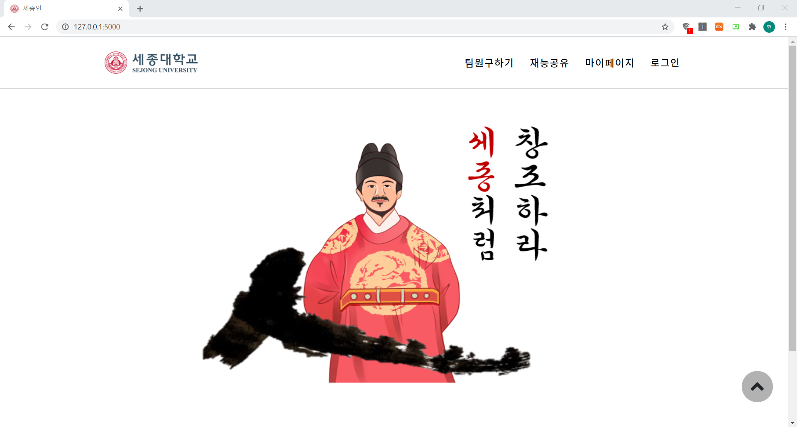
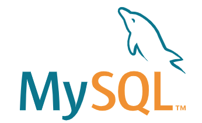

# < 해커톤 2020 >

### 세종대학교 2020 후반기 해커톤 프로젝트 '세종인'
> #### 🏆 장려상 수상

 

## 팀원

|이름|기여|
|---|---|
|<a href="https://github.com/hon99oo">강홍구</a>|💰 Block Chain|
|<a href="https://github.com/ghis22130">김지수</a>|📂 DB, Backend|
|<a href="https://github.com/woogie-s">신현욱</a>|💰 Block Chain|
|<a href="https://github.com/Jaeyooou">안재현</a>|📂 DB, Backend|
|<a href="https://github.com/hanjo8813">한재원</a>|📄 Frontend, Backend|

 

## 사이트 소개
1. 세종인은 세종대학교 비교과 마일리지 시스템에 `블록체인`을 접목하여 공유경제 서비스를 구현한 웹사이트입니다.
2. 학교 생활을 하다보면 자신과 다른 전공의 재능이 필요할 때가 있습니다.
3. 세종인은 그 재능이 있는 사람이 그에 상응하는 대가를 받고 재능을 공유할 수 있도록 하는 서비스입니다.
4. 재능 공유는 `재능공유` 게시판을 통해 이루어집니다.
5. 타인의 재능이 필요한 사용자는 `재능공유` 게시판에 구인글을 게시할 수 있습니다.
6. 재능 공유자는 게시판에서 구인글을 살펴보고 신청할 수 있습니다.
7. 등록,신청현황의 관리는 `마이페이지`에서 이루어집니다.
8. 등록자가 신청을 수락하게 되면 `블록체인`으로 구현된 마일리지의 거래가 이루어집니다.
8. 또한 `마이페이지`에서 자신의 마일리지와 이력을 관리할 수 있습니다.

 

 

## 개발 정보

<table style="text-align:center;">
    <tr>
        <th>Block Chain</th>
        <th>Frontend</th>
        <th>Backend</th>
        <th>Database</th>
    </tr>
    <tr>
        <td>
        
        </td>
        <td>
        &nbsp;
        
        </td>
        <td> 
        
        </td>
        <td>
        
        </td>
    </tr>
    <tr>
        <td>
        Flask
        </td>
        <td>
        Bootstrap, W3
        </td>
        <td>
        Flask
        </td>
        <td>
        MySQL
        </td>
    </tr>
</table>